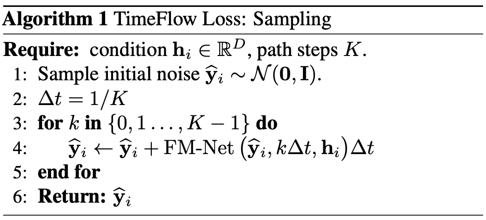
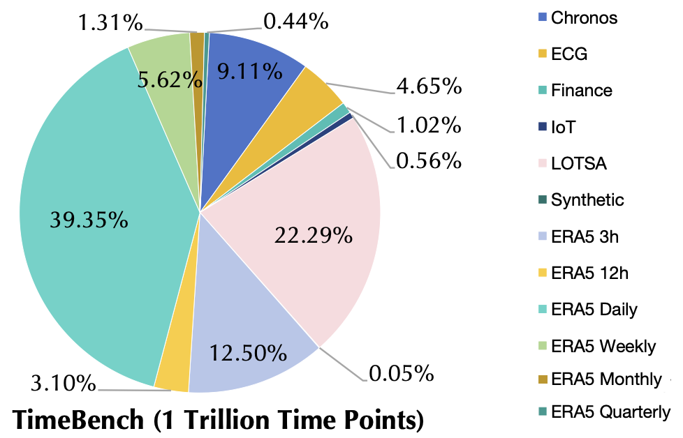

# Sundial

Sundial: A Familiy of Highly Capable  Time Series Foundation Models [[Paper]](https://arxiv.org/abs/2502.00816).

:triangular_flag_on_post: **News** (2025.05) Released a **trillion-scale** pre-trained model on [HuggingFace](https://huggingface.co/thuml/sundial-base-128m). A quickstart usage is provided [here](./quickstart_zero_shot.ipynb).

:triangular_flag_on_post: **News** (2025.05) **Ranked 1st MASE** on the [GIFT-Eval](https://huggingface.co/spaces/Salesforce/GIFT-Eval) Benchmark.

:triangular_flag_on_post: **News** (2025.05) Sundial has been accepted as **ICML 2025 Spotlight**. See you at Vancouver :)

## Introduction

Sundial is a familiy of **generative** time series foundation models. The model can make zero-shot predictions for both **point** and **probabilistic** forecasting.


💡 We propose TimeFlow Loss to predict next-patch’s distribution, allowing Transformers to be trained **without discrete tokenization** and make **multiple probable predictions**.

💪 We present Sundial, a family of **scalable** and **efficient** time series foundation models pre-trained on **1 trillion** time points, utilizing our enhanced Transformer.

🏆 Sundial achieves **state-of-the-art** zero-shot performance on point forecasting and probabilistic forecasting, including best-recognized benchmarks [GIFT-Eval](https://huggingface.co/spaces/Salesforce/GIFT-Eval), [FEV](https://huggingface.co/spaces/autogluon/fev-leaderboard), and [TSLib](https://github.com/thuml/Time-Series-Library), positioning generative time series foundation models as a capable tool for decision-making.

<p align="center">

</p>

## Architecture

<p align="center">

</p>

The input time series is divided into patch tokens, which are embedded from original continuous values. The patch embeddings are fed into a decoder-only Transformer, a stable and speedup version that learns token representations via causal self-attention. The model is optimized using our **TimeFlow** Loss.

> For our previous work, please refer to [**Tim**e-Series-Transform**er** (Timer)](https://github.com/thuml/Large-Time-Series-Model)


## TimeFlow Loss

We propose TimeFlow Loss, a parameterized loss function that models per-token probability distribution conditioned on input representations, and generates multiple plausible predictions under the flow-matching framework.

This optimization objective operates on original values and facilitates patch-level generation for quick inference, which is highly compatible with continuous-valued modalities, such as time series


> Training

$$
\mathcal{L}_{\text {TimeFlow }}=\sum_i^N \| \text { FM-Net }\left(\mathbf{y}_i^{(t)}, t, \mathbf{h}_i\right)-\left(\mathbf{y}_i-\mathbf{y}_i^{(0)}\right) \|^2
$$

> Sampling

<p align="center">

</p>

## TimeBench

We collected and curated TimeBench, which comprises over 1 trillion high-quality time points from various sources. Most datasets are collected from real-world records, a small portion (0.05%) is generated synthetically to enhance pattern diversity.

<p align="center">

</p>

## Evaluation

We compare Sundial with advanced time series foundation models on various benchmarks, including (1) Point forecasting: we adopt the long-term forecasting benchmark [TSLib](https://github.com/thuml/Time-Series-Library) using MSE and MAE; (2) Probabilistic forecasting: we experiment on [GIFT-Eval](https://huggingface.co/spaces/Salesforce/GIFT-Eval) and [FEV leaderboard](https://huggingface.co/spaces/autogluon/fev-leaderboard), assessing point (MASE) and probabilistic (CRPS and WQL) metrics.


## Citation

If you find this repo helpful, please cite our paper. 

```
@article{liu2025sundial,
  title={Sundial: A Family of Highly Capable Time Series Foundation Models},
  author={Liu, Yong and Qin, Guo and Shi, Zhiyuan and Chen, Zhi and Yang, Caiyin and Huang, Xiangdong and Wang, Jianmin and Long, Mingsheng},
  journal={arXiv preprint arXiv:2502.00816},
  year={2025}
}
```

## Acknowledgment

We appreciate the following GitHub repos a lot for their valuable code and efforts:

- Time-Series-Library (https://github.com/thuml/Time-Series-Library)
- Large-Time-Series-Model (https://github.com/thuml/Large-Time-Series-Model)
- Timer-XL (https://github.com/thuml/Timer-XL)

## Contact

If you have any questions or want to use the code, feel free to contact:

* Yong Liu (liuyong21@mails.tsinghua.edu.cn)
* Guo Qin (qinguo24@mails.tsinghua.edu.cn)
