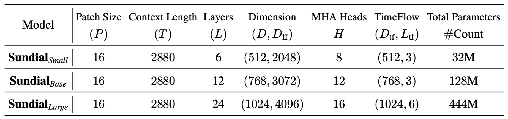

# Sundial

This is the official implementation of [Sundial: A Familiy of Highly Capable  Time Series Foundation Models](https://arxiv.org/abs/2502.00]816).

<p align="center">

</p>


## Updates

:triangular_flag_on_post: **News** (2025.05) Released a **trillion-scale** pre-trained model on [HuggingFace](https://huggingface.co/thuml/sundial-base-128m). A quickstart is provided [here](./example/quickstart_zero_shot.ipynb).

:triangular_flag_on_post: **News** (2025.05) Get **1st MASE** on the [GIFT-Eval](https://huggingface.co/spaces/Salesforce/GIFT-Eval) Benchmark.

:triangular_flag_on_post: **News** (2025.05) Sundial has been accepted as **ICML 2025 Spotlight**. See you at Vancouver :)

## Introduction

Sundial is a familiy of **generative** time series foundation models. The model can be applied for both **point** and **probabilistic** forecasting.


We propose **TimeFlow Loss** to predict next-patch’s distribution, allowing Transformers to be trained **without discrete tokenization** and make **non-deterministic predictions**.

<p align="center">

</p>

## Quickstart

We release the checkpoint and model wrapper to make zero-shot predictions on your customized data:

```
pip install transformers==4.40.1
```

```
import torch
from transformers import AutoModelForCausalLM

# load pretrain model
# supports different lookback/prediction lengths
model = AutoModelForCausalLM.from_pretrained('thuml/sundial-base-128m', trust_remote_code=True) 

# prepare input
batch_size, lookback_length = 1, 2880 
seqs = torch.randn(batch_size, lookback_length)

# generate multiple probable predictions
prediction_length = 96 
num_samples = 20

output = model.generate(seqs, max_new_tokens=prediction_length, num_samples=num_samples)

# use raw predictions for mean/quantiles/confidence-interval estimation
print(output.shape) 
```

More examples for predicting quantiles or confidence intervals is provided [here](https://github.com/thuml/Sundial/blob/main/examples/quickstart_zero_shot.ipynb).

## Architecture

<p align="center">

</p>

> Intuitively, Sundial can be viewed as an ARMA model (Auto-Regression and Moving-Average). Transformer learns auto-regressive token representations. Conditioned on them, TimeFlow transforms random noises into non-deterministic predictions.

## Evaluation

We evaluate Sundial with advanced time series foundation models on well-recognized benchmarks:

- [FEV Leaderboard](./figures/fev_res.png)
- [GIFT-Eval(**1st MASE**)](./figures/gift_res.png)
- [Time-Series-Library (**1st MSE/MAE**)](./figures/tslib_res.png)

## Future Work

✨ Exciting news! Code for fine-tuning is on its way and will be available soon! Stay tuned for updates! 🚀

## Citation

If you find this repo helpful, please cite our paper. 


```
@article{liu2025sundial,
  title={Sundial: A Family of Highly Capable Time Series Foundation Models},
  author={Liu, Yong and Qin, Guo and Shi, Zhiyuan and Chen, Zhi and Yang, Caiyin and Huang, Xiangdong and Wang, Jianmin and Long, Mingsheng},
  journal={arXiv preprint arXiv:2502.00816},
  year={2025}
}
```

## Acknowledgment

We appreciate the following GitHub repos a lot for their valuable code and efforts:

- Time-Series-Library (https://github.com/thuml/Time-Series-Library)
- Large-Time-Series-Model (https://github.com/thuml/Large-Time-Series-Model)
- Timer-XL (https://github.com/thuml/Timer-XL)

## Contact

If you have any questions or want to use the code, feel free to contact:

* Yong Liu (liuyong21@mails.tsinghua.edu.cn)
* Guo Qin (qinguo24@mails.tsinghua.edu.cn)
